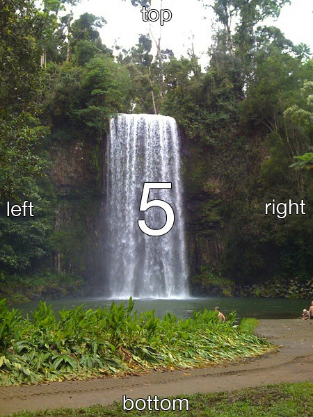
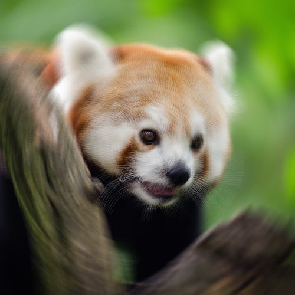
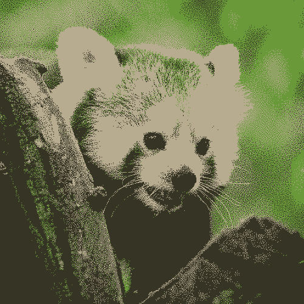
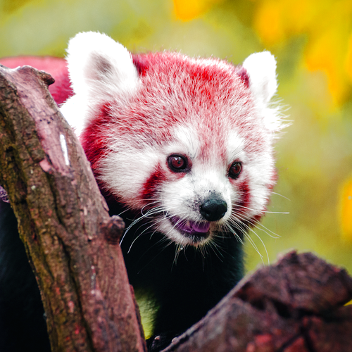
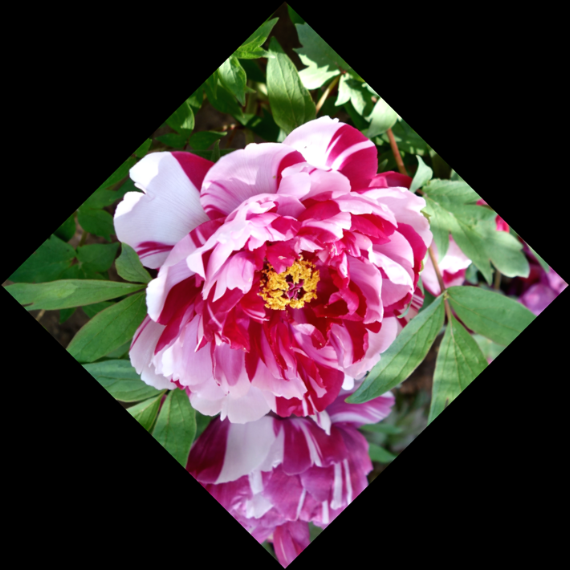
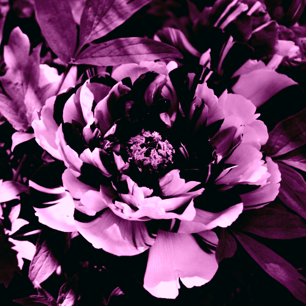
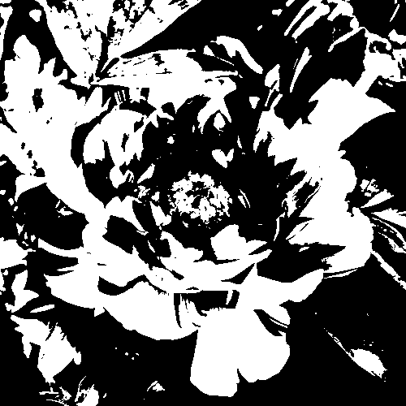
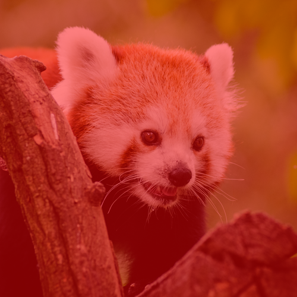
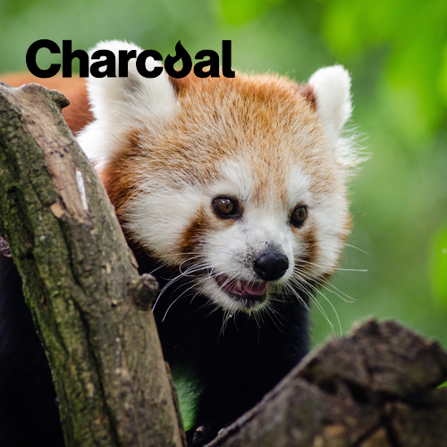

## Charcoal Image API

# Available effects / operations

Any image operation is called an "effect" and implements the `\Charcoal\Image\EffectInterface` interface.

The available effects are:

-   [Auto-orientation](#auto-orientation-effect)
-   [Blur](#blur-effect)
-   [Dither](#dither-effect)
-   [Grayscale](#grayscale-effect)
-   [Mask](#mask-effect)
-   [Mirror](#mirror-effect)
-   [Modulate](#modulate-effect)
-   [Resize](#resize-effect)
-   [Revert](#revert-effect)
-   [Rotate](#rotate-effect)
-   [Sepia](#sepia-effect)
-   [Sharpen](#sharpen-effect)
-   [Threshold](#threshold-effect)
-   [Tint](#tint-effect)
-   [Watermark](#watermark-effect)

## Auto-orientation Effect

**Reads image EXIF data to automatically rotate it to the proper orientation**

### Options

-   _none_

### Examples


-   Default image (with EXIF orientation #5)



-   Auto-orientation (with EXIF orientation #1): `$img->autoorientation();`

## Blur Effect

**Blurs an image**

### Options

-   `mode` (_string_)
    -   The type of blur to apply. Possible valures are: `standard`, `adaptive`, gaussian`, `motion`, `radial`, `soft` (Currently unsupported)
-   `radius` (_float_)
    -   Defines the extent or size of the filter (technically, the size of the array which hold the calculated Gaussian distribution).
    -   If 0, a default optimal radius will be auto-determined.
    -   Bigger radius results in slower effect.
    -   Default is `0`.
-   `sigma` (_float_)
    -   Determines the actual amount of blurring that will take place.
    -   Default is `1`.

-   `channel` (_int_)
-   `angle` (_float_)
    -   The angle of the blur. Only used in `motion` or `radial` mode.
    -   Default is `0`.

### Blur Modes

-   `standard`
    -   Perform a standard blur operation on the image.
-   `adaptive`
    -   Perform an adaptive blur on the image.
    -   The intensity of an adaptive blur depends is dramatically decreased at edge of the image, whereas a standard blur is uniform across the image.
-   `gaussian`
    -   Perform a gaussian blur on the image.
-   `motion`
    -   Simulate a motion blur effect on the image.
    -   The "direction" of the blur is determined by the `angle` paramter.
-   `radial`
    -   Perform a radial (circular) blur on the image.
    -   The `angle` argument is the angle the radial-blur coversThat is half that angle in each direction from the original image. So an angle of 180 is over a half circle, while 360 degrees will blur the image in a full circle.
    -   The `sigma` and `radius` parameters are ignored in this mode.
-   `soft`
    -   Blend the blur with the original image.
    -   Note that the `channel` value is ignored in this mode.

> 👉 The `soft` mode is currently only available with the `imagemagick` driver.

### Examples


-   Gaussian blur: `$img->blur([ 'mode' => 'gaussian', 'radius' => 5, 'sigma' => 5 ]);`



-   Radial blur: `$img->blur([ 'mode' => 'radial', 'angle' => 8 ]);`

## Dither Effect

**Reduces an image's colors to a certain number, using dithering.**

### Options

-   `colors` (_int_)
    -   The number of colors to reduce to

> 👉 The `dither` effect is currently only available with the `imagick` driver.

### Examples



-   Dither wit 3 colors: `$img->dither([ 'colors' => 3 ]);`

## Grayscale Effect

**Converts an image's colors to a 256-colors greyscale. There are no options.**

### Options

-   _none_

### Examples


-   Grayscale: `$img->grayscale();`

## Mask Effect

**Apply a 8-bit transparency mask to the image.**

### Options

-   `mask` (_string_)
-   `opacity` (_float_)
-   `gravity` (_string_)
-   `x` (_integer_)
-   `y` (_integer_)

> 👉 The `mask` effect is currently not supported by any driver.

## Mirror Effect

**Flip an image horizontally or vertically.**

### Options

-   `axis` (_string_)
    -   The axis can be "x" (flip) or "y" (flop).
    -   Default is "y".

### Examples


-   Mirror (x-axis): `$img->mirror([ 'axis' => 'x' ]);`


-   Mirror (x-axis): `$img->mirror([ 'axis' => 'y' ]);`

## Modulate Effect

**Modifies an image's colors in the special HSL (hue-saturation-luminance) colorspace.**

### Options

-   `hue` (_float_)
    -   The **color tint** value, between -100 and 100.
    -   Default is `0` (no effect)
-   `saturation` (_float_)
    -   The **color intensity** value, between -100 and 100.
    -   Default is `0` (no effect)
-   `luminance` (_float_)
    -   The **brightness** value, between -100 and 100.
    -   Default is `0` (no effect)

### Examples


-   Modulate with brightness only: `$img->modulate([ 'luminance' => 50 ]);`



-   Modulate HSL: `$img->modulate([ 'luminance' => 20, 'hue' => -20, 'saturation' => 40 ]);`

## Resize Effect

**Resize an image to given dimensions.**

### Options

-   `mode` (_string_)
    -   The type of resize operation to perform
    -   Valid modes are: `auto`, `exact`, `width`, `height`, `best_fit`, `crop`, `fill` or `none`.
    -   Default is `auto`.
-   `width` (_integer_)
    -   The target's width, in pixels.
    -   Mandatory in `width`, `exact`, `best_fit`, `crop` and `fill` modes
    -   Default is `0`.
-   `height` (_integer_)
    -   The target's height, in pixels.
    -   Mandatory in `height`, `exact`, `best_fit`, `crop` and `fill` modes
    -   Default is `0`.
-   `gravity`
    -   The gravity, only used in `crop` mode.
    -   Defaults to `center`
-   `background_color` (_string_)
    -   The background color, only used in `fill` mode.
    -   Can be specified as hexadecimal ("#FF00FF"), RGB values ("rgb(255,0,255)") or color name ("red").
    -   Default is _transparent-white_ (`rgb(100%, 100%, 100%, 0)`)
-   `adaptive`

### Resize Modes

-   `auto`
    -   Auto-determined from effect options.
-   `exact`
    -   Resize to an exact width and height (ignoring original ratio).
-   `width`
    -   Resize to an exact width, keeping aspect ratio.
    -   In this mode, the `width` parameter is required and the `height` parameter is ignored.
-   `height`
    -   Resize to an exact height, keeping aspect ratio.
    -   In this mode, the `width` parameter is required and the `height` parameter is ignored.
-   `best_fit`
    -   Resize to the maximum `width` or `height`, keeping aspect ratio.
-   `crop`
    -   Resize to the best match possible (oversized) to keep ratio and crop the superfluous data.
-   `fill`
    -   Resize to the best match possible (undersize) to keep ratio and fill the superfluous area with the `background_color`.
-   `none`
    -   Ignore resize operation entirely (do nothing)

## Revert Effect

**Revert (negate) the image's colors.**

### Options

-   `channel` (_string_)

### Examples


-   Revert default (all channels): `$img->revert();`


-   Revert red channel: `$img->revert([ 'channel' => 'red' ]);`

## Rotate Effect

**Rotate the image by a certain angle.**

### Options

-   `angle` (_float_)
    -   The angle of rotation, in degrees (clockwise).
    -   Note that the dimension of the image can be modified if it is not square or if the angle is not a multiple of 90 degrees.
    -   Distortion will occur for any angle other than multiple of 90 degrees.
    -   Default to 0. (No rotation)
-   `background_color` (_string_)
    -   The background color of the canvas.
    -   Only used if the angle is not a multiple of _90_.
    -   Can be specified as hexadecimal ("#FF00FF"), RGB values ("rgb(255,0,255)") or color name ("red").
    -   Default is _transparent-white_ (`rgb(100%, 100%, 100%, 0)`)

### Examples


-   Rotate 90: `$img->rotate([ 'angle' => 90 ]);`


-   Rotate -135: `$img->rotate([ 'angle' => -135 ]);`



-   Rotate 135, black background: `$img->rotate([ 'angle' => 135, 'background_color' => 'black' ]);`

## Sepia Effect

**Tint the image with a vintage, sepia look**

### Options

-   `threshold` (_float_)
    -   The level of the sepia tone effect.
    -   Default is `75`.

### Examples


-   Default sepia (75): `$img->sepia();`



-   Default sepia (75): `$img->sepia([ 'threshold' => 115 ]);`

## Sharpen Effect

**Sharpen an image, with a simple sharpen algorithm or unsharp mask options.**

### Options

-   `mode` (_string_)
    -   Can be `standard`, `adaptive` or `unsharp`
-   `radius` (_float_)
    -   The sharpen radius
    -   Default is `0`.
-   `sigma` (_float_)
    -   Default is `1`.
-   `amount` (_float_)
    -   The amount (or _gain_) to unsharp.
    -   Only used in `unsharp` mode.
    -   Default is `1`
-   `threshold` (_float_)
    -   Only used in `unsharp` mode.
    -   Default is `0.05`
-   `channel`

### Sharpen Modes

-   `standard`
    -   Perform a simple, standard sharpen operation on the image.
-   `adaptive`
-   `unsharp`
    -   Sharpen the image with a more complex

## Threshold

**Convert the image to monochrome (black and white).**

### Options

-   `threshold` (_float_)

### Examples



-   Default threshold: `$img->threshold();`

## Tint Effect

**Tint (or colorize) an image with a certain color.**

### Options

-   `color` (_string_)
    -   Color to blend unto the image.
    -   Can be specified as hexadecimal ("#FF00FF"), RGB values ("rgb(255,0,255)") or color name ("red").
    -   Default is black (`rgb(0,0,0)`).
-   `opacity` (_float_)
    -   Percentage of the value to blend, as a float between 0.0 and 1.0
    -   Default to 50% (`0.5`).
-   `midtone` (_boolean_)
    -   If true, then the color will be blended only to the midtones.
    -   Technically, true call the _tint_ function while false calls the _colorize_ function.
    -   Default is `true`.

### Examples



-   Colorize / Tint red: `$img->tint([ 'color' => 'rgb(100%,0,0)', 'midtone' => false ]);`


-   Midtone tint red: `$img->tint([ 'color' => 'rgb(100%,0,0)' ]);`

## Watermark Effect

**Composite a watermark on top of the image.**

### Options

-   `watermark` (_string_ or _ImageInterface_)
-   `opacity` (_float_)
-   `gravity` (_string_)
-   `x` (_integer_)
-   `y` (_integer_)

### Notes

-   The effect of the `x` and `y` values depends of the `gravity`.
    -   Default gravity is "nw" for a top-left watermark. Set to "center" to align to center.
-   The `opacity` option is currently ignored by both drivers.
-   The watermark image will always be rescaled to fit inside the image's container.
-   It will also always be moved to ensure the watermark is inside the image's container.

### Examples



-   Watermark: `$img->watermark([ 'watermark => 'charcoal.png' ]);`

## Advanced (chained effects) example


```php
use \Charcoal\Image\Imagick\ImagickImage as Image;;

$watermark = new Image();
$watermark->open(__DIR__.'/tests/examples/watermark.png')
    ->blur([ 'mode' => 'gaussian', 'sigma' => 2 ])
    ->rotate([ 'angle' => 45 ])
    ->tint([ 'color' => 'red', 'midtone' => false ]);

$watermark2 = new Image();
$watermark2->open(__DIR__.'/tests/examples/watermark.png')
    ->blur([ 'mode' => 'gaussian', 'sigma' => 1 ])
    ->tint([ 'color' => 'blue', 'midtone' => false ]);

$img = new Image();
$img->open(__DIR__.'/tests/examples/test02.png')
    ->mirror([ 'axis' => 'y' ])
    ->sharpen([ 'mode' => 'unsharp', 'amount' => 2 ])
    ->watermark([ 'watermark' => $watermark, 'gravity' => 'ne' ])
    ->watermark([ 'watermark' => $watermark2, 'gravity' => 'w' ])
    ->modulate([ 'luminance' => 25 ])
    ->save(__DIR__.'/out.png');
```

## Future Effects

These effects are available in the `imagick` library and therefore could easily be added:

-   `Charcoal`
-   `Chop`
-   `Fx`
-   `Emboss`
-   `Blueshift`
-   `Border`
-   `Edge`
-   `Equalize`
-   `Gamma`
-   `Oilpaint`
-   `Posterize`
-   `Reducenoise`
-   `Swirl`
-   `Wave`
